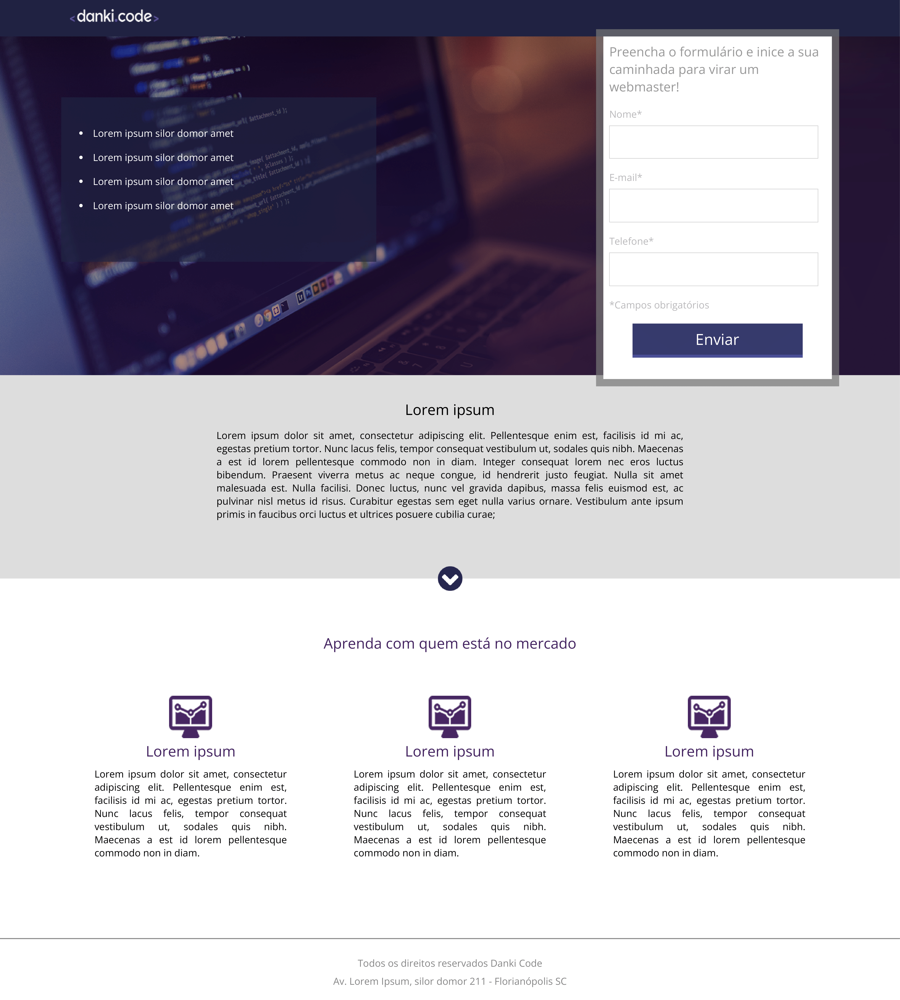

## 🖥️ Danki Code Landing Page 🖥️

### 📄 Resumo do Projeto 📄
Fiz uma landing page, seguindo o tutorial da Danki Code e as dicas do professor Guilherme Grillo.

##

### 🖼️ Prévia do Projeto 🖼️

    

##

### 📖 Descrição do Projeto 📖
O projeto é é baseado em uma imagem disponibilizada no curso de uma landing page experimental da Danki Code.
Essa página, por mais simples que seja, é a primeira na qual aplico um design responsivo e divisões de página mais concretas, além de um estilo mais adaptado e conceitual.

##

### 🛠️ Tecnologias aprendidas e utilizadas 🛠️

  
  

##

Agradeço a sua atenção e leitura deste documento!

Atenciosamente, 

Milton Salgado ⚡
